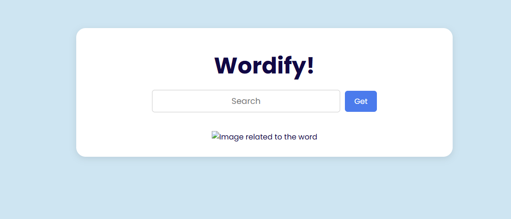
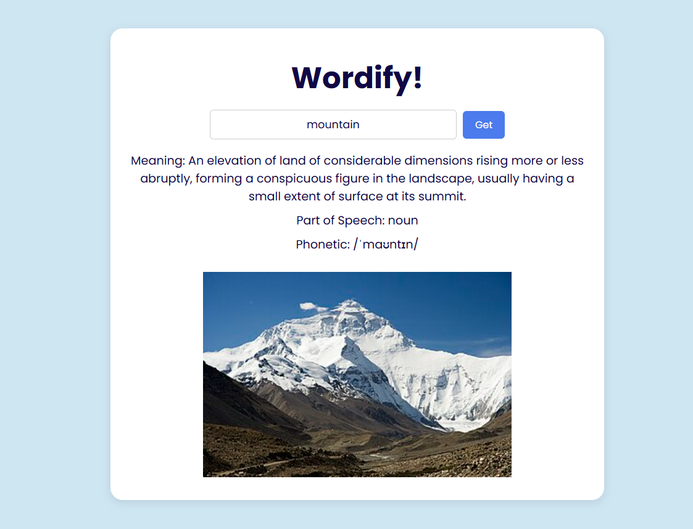

# Wordify 🧠✨

A fun and interactive word-based project built using HTML, CSS, and JavaScript.

---

## 🔗 Live Demo  
Check out the live version here:  
👉 [https://erleen0307.github.io/wordify/](https://erleen0307.github.io/wordify/)

---

## 📌 Features
- Clean and responsive user interface  
- Real-time word data fetched using APIs  
- Interactive UI elements powered by vanilla JavaScript  

---

## 🛠️ Technologies Used
- HTML5  
- CSS3  
- JavaScript (ES6)  

---

## 🌐 APIs Used
- [Dictionary API](https://dictionaryapi.dev/) – For getting word definitions, phonetics, and meanings  
- [Wikimedia API](https://www.mediawiki.org/wiki/API:Main_page) – For fetching related images  

---

## 🚀 How to Use / Make It Yourself

### 1. Clone the Repository

```bash
git clone https://github.com/erleen0307/wordify.git
cd wordify
```

### 2. Open `index.html`

Just open the file in your browser:

```bash
start index.html
```

No additional setup needed — it's a pure front-end project.

---

## 📁 Project Structure

```
wordify/
├── index.html
├── style.css
├── script.js
├── screenshot1.png
├── screenshot2.png
└── README.md
```

---

## 📸 Screenshots  

### 🔤 Search Interface  


### 📖 Word Details with Image  


---

## 🙋‍♀️ Author

Made with ❤️ by [@erleen0307](https://github.com/erleen0307)
